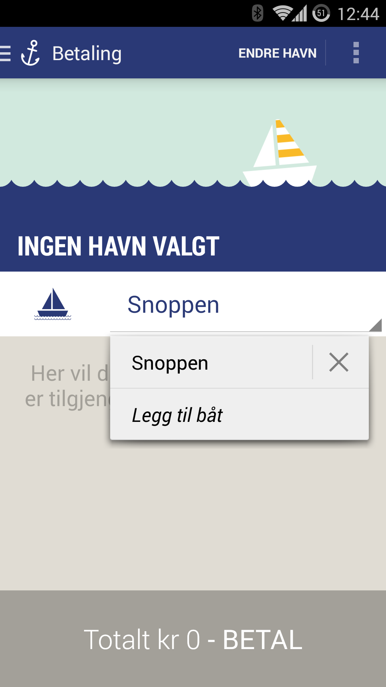
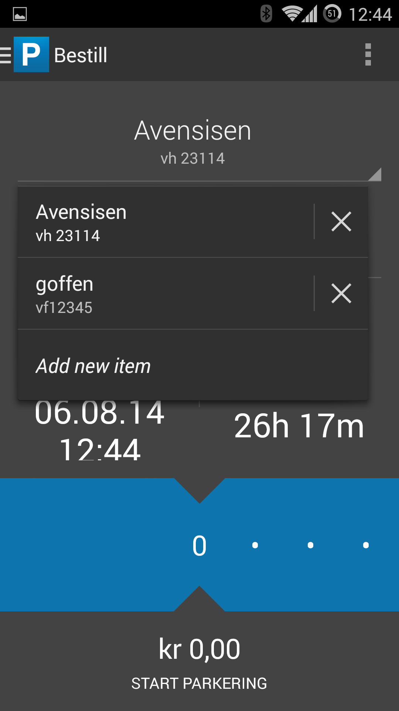

AndroidDynamicSpinner
=====================

```
<dependency>
  <groupId>no.wtw.android</groupId>
  <artifactId>android-dynamic-spinner</artifactId>
  <type>apklib</type>
  <version>xxx</version>
</dependency>
```

## Usage

1. Subclass DynamicSpinner and set the item generic type.  
```MyItemSpinner extends DynamicSpinner<MyItemType>```
1. Subclass DynamicSpinnerAdapter, set generic type (same as above), and override the methods required.  
```MyItemSpinnerAdapter extends DynamicSpinnerAdapter<MyItemType> ```  
The adapter provides custom selected and dropdown views for your items. 
1. Add items to the adapter (standard procedure), and ddd the adapter to the spinner.
1. Setimplement the dynamic spinner listener. This handles clicks on items, delete button and add button.  
```myItemSpinner.setDynamicSpinnerListener(myListener) ```
1. Implement callback required by listener. (onItemDelete, onItemSelected, onItemAdd). 

## Screenshots

 

## Theming

The delete icon in the spinner may be replaced by an icon of your choice. First add a style to your theme:

```
...
<item name="ds_dynamicSpinnerStyle">@style/mySpinnerStyle</item>
...
```

Then add an icon reference in the style you created:

```
<style name="myDynamicSpinnerStyle">
    <item name="ds_deleteItemIcon">@drawable/my_delete_icon</item>
</style>
```

